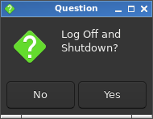

# graphical_prompt.sh

graphical_prompt.sh is a shell script that uses zenity to create a graphical prompt before executing a given command. I originally wrote it to use as a logout prompt for openbox, but the script can be used to prompt before running any command.

### Usage

`graphical_prompt.sh COMMAND [PROMPT]`

### Example

The script can be used to prompt before shut down as follows:

`graphical_prompt.sh "shutdown now" "Log Off and Shutdown?"`

Running the above will generate the following prompt:

